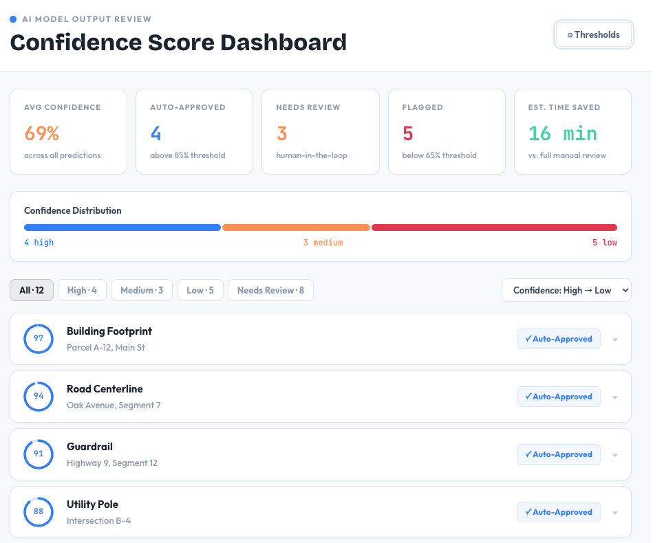

# AI Confidence Score Dashboard

An interactive prototype demonstrating how AI products should surface model uncertainty to end users — moving beyond single accuracy metrics to prediction-level confidence scores with actionable context.

🔗 **[Try the live demo →](https://vercel.com/jananmgs-projects/ai-confidence-dashboard)**



---

## The Problem

Most AI products tell users "our model is 94% accurate" and call it a day. But aggregate accuracy doesn't help a user decide whether to trust *this specific prediction* on *this specific input*. A geospatial analyst looking at an AI-generated building footprint needs to know: should I trust this output, or should I review it manually?

This dashboard is a working prototype for how to solve that problem.

## What It Demonstrates

**Prediction-level confidence scores** — each AI output gets its own confidence rating, not just a global accuracy number. Users can immediately see which outputs are reliable and which need attention.

**Model reasoning** — instead of a black-box score, each prediction includes an explanation of *why* the model is confident or uncertain. "Partial tree canopy shadow overlap" is actionable. "79% confidence" alone is not.

**Adjustable automation thresholds** — the interactive sliders let users (or product teams) explore the core tradeoff: where do you draw the line between auto-approve and human review? Set it too high and you lose efficiency. Too low and you ship errors.

**Review time estimates** — for predictions that need human review, the dashboard shows estimated time to review. This lets teams prioritize their review queue and forecast capacity.

**Filtering and sorting** — users can slice the data by confidence level, review status, or feature type to focus on what matters.

## The Product Thinking

### Why prediction-level confidence matters

In domains where AI outputs feed into real-world decisions — construction, surveying, telecom engineering — a single wrong prediction can cost thousands of dollars. Users don't need perfect AI. They need AI that *knows what it doesn't know* and tells them about it.

### The threshold tradeoff is the core product decision

The adjustable thresholds are the most important element in this dashboard. They represent the question every AI product team has to answer: how much do we trust our model?

At an 85% auto-approve threshold, roughly one-third of predictions get approved automatically. Drop it to 70% and you approve more — but your error rate goes up. The right answer depends on the cost of errors in your domain, and making this tradeoff visible to users is what builds trust over time.

### Designed for the human-in-the-loop workflow

This isn't a dashboard for data scientists monitoring model performance. It's designed for the end user — the survey technician, the project manager, the field engineer — who needs to decide what to trust and what to verify. Every design decision prioritizes that workflow:

- Confidence rings give instant visual signal without reading numbers
- Expandable rows keep the default view scannable
- Review time estimates help users plan their work
- Approve / Edit / Reject actions are inline, not buried in a separate screen

## Built With

- React + Vite
- Custom components — no external UI libraries
- Responsive design for desktop and tablet

## Local Development

```bash
git clone https://github.com/jananmg/ai-confidence-dashboard.git
cd ai-confidence-dashboard
npm install
npm run dev
```

## About Me

I'm a product leader focused on AI/ML products in the geospatial and infrastructure space. This prototype was built to demonstrate how AI products can earn user trust through transparency rather than just accuracy metrics.

**[LinkedIn](https://www.linkedin.com/in/jananguillaume/)**

---

*If you find this useful, give it a ⭐ — it helps others discover it.*
